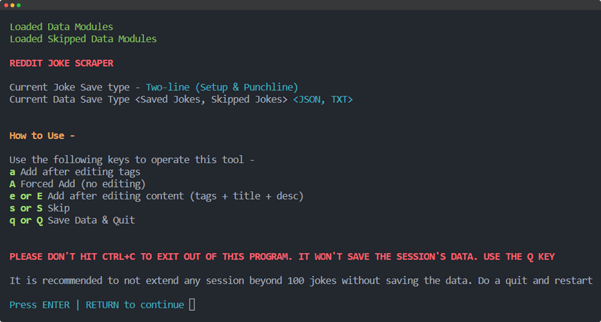
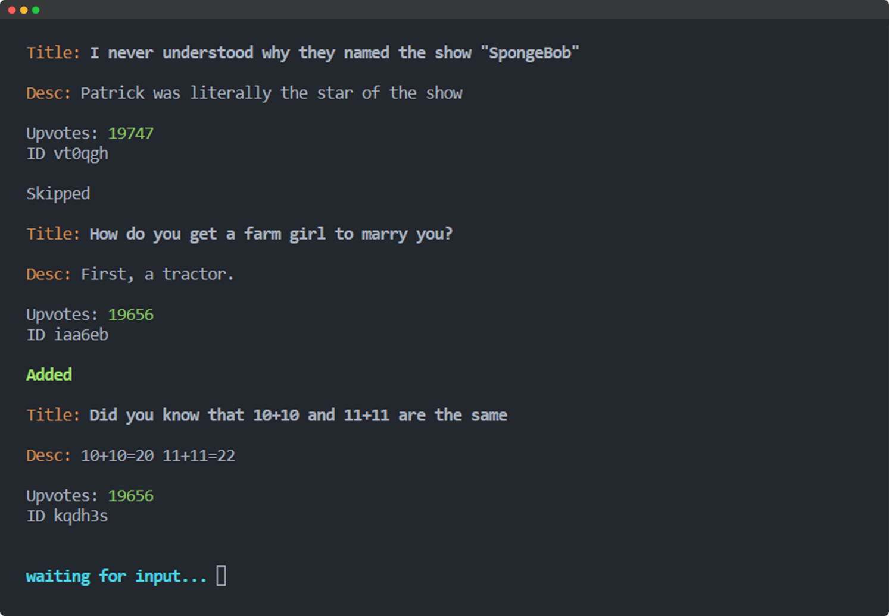
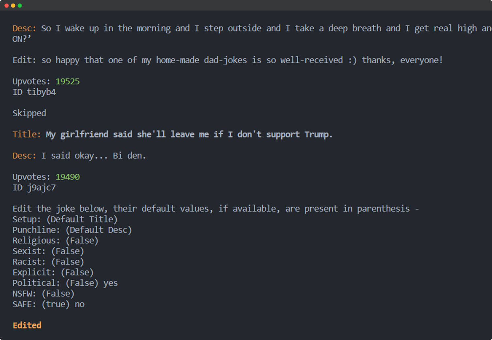

A Joke Browsing and Dataset Creation CLI tool, made with Python, that uses the Reddit API to get posts and save the content to a local file.

With the help of Reddit Joke Scrapper, you can see all content in a subreddit, add flags to the content manually, edit the content & save it all to a file in your computer.

Clone this repository and head to the \`Steps to Follow section\` to get started.

## 🌟 Features

- Get all posts in a subreddit sorted by upvotes
- Jokes are saved with essential "safety" tags
- Edit tags
- Edit content
- Colorful output
- *more features on the way...*

## 📱 Screenshots

<p align="center">

</p>

- Browse through jokes and add them

     

- Edit Joke content and add tags to your liking

     

## ❓How to Use

### Pre-requisites
- **Python & PIP** are installed and added to `PATH`

### Steps to Follow

- Create an Application, & get the credetentials from your [Reddit Developer Account]()
    
    > for URL, you may put `http://localhost:8080`

- Create a `.env` file in the project root directory with the obtained APP ID
    ```
    USERAGENT=<your reddit application name>
    CLIENT_ID=<22 characters long client id>
    CLIENT_SECRET=<30 characters long client secret>
    REDIRECT_URL=http://localhost:8080
    USERNAME=<your Reddit developer account username>
    PASSWORD=<your account password>
    ```
- Get the dependencies, in your terminal, execute -
    ```
    pip -r requirements.txt
    ```
- That's it, now you can run it -
    ```
    python scraper.py
    ```


## 🤝 Contributing

Contributions are always welcome!

See the [Contribution Guide](contributing.md) for ways to get started.

## 📖 Lessons Learned

**Reddit Joke Scraper** has been a really fun project. It's always amazing to start your programming with a bunch of laughter. This tool did just that.

But I made this tool to create a reliable Dad-Jokes and Puns dataset that I couldn't find anywhere else. This automated the process of maintaining such a dataset.

This tool has been used directly for another project of mine . . . coming soon!

I learnt many things along the way, the most notable ones are mentioned below -

- Reddit API
- PRAW
- ANSI printing and deletion
- **and so much more...**

## 💡 Authors

- [@Anikate De](https://www.github.com/Anikate-De)

## 📝 License

Copyright © 2022-present, Anikate De

This project is licensed under [Apache License 2.0](LICENSE)